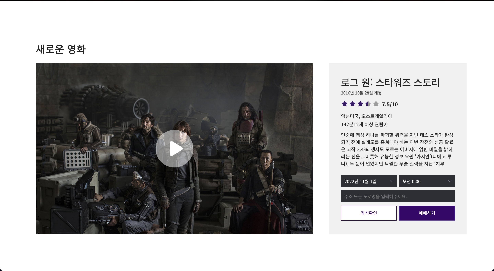

# 메가박스 웹사이트 (megabox website)

   
  
  
  
  
  
   

목차

## 영화관 기업 메가박스 웹사이트를 리뉴얼하여 반응형으로 제작한 웹사이트입니다.

피그마를 이용하여 디자인을 하고 반응형에 맞게 작업하였습니다. 
swiper 라이브러리를 이용하여 slider를 구성하였고  
IFrame Player API를 통해 웹사이트에 YouTube 동영상 플레이어를 퍼가고  
JavaScript를 사용하여 플레이어를 제어하였습니다.

 

## 기술 스택

|    html    |     css    |     figma.   |.    javascript.  |
| :--------: | :--------: | :--------:   |     :--------:   |
|  ![html]   |   ![css]   |   ![figma].  | ![javascript].   |

 

## 구현 기능

### 기능 1
swiper 라이브러리 이용하여 slider 구현  
### 기능 2
jquery를 이용하여 영화 탭 메뉴 구현  
class에 속성을 넣어주고 없애고 생성해주는 방식  
### 기능 3
Youtube 내 API를 통해 Iframe삼입  
### 기능 4
모달창을 생성하여 Iframe 동영상 닫기 열기 기능 구현  

 

<!-- Stack Icon Refernces -->
[html]: assets/img/stack/html.svg
[css]: assets/img/stack/css.svg
[figma]: assets/img/stack/figma.svg
[ts]: assets/img/stack/typescript.svg
[react]: assets/img/stack/react.svg
[node]: assets/img/stack/node.svg
[javascript]: assets/img/stack/javascript.svg
